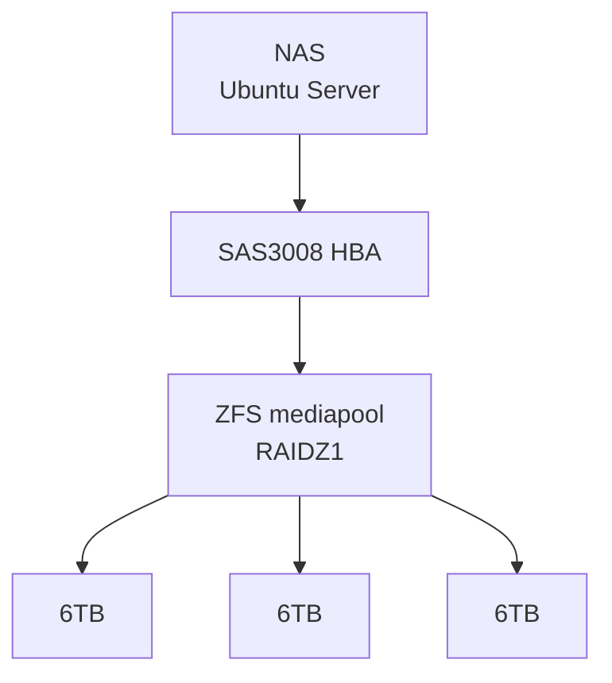
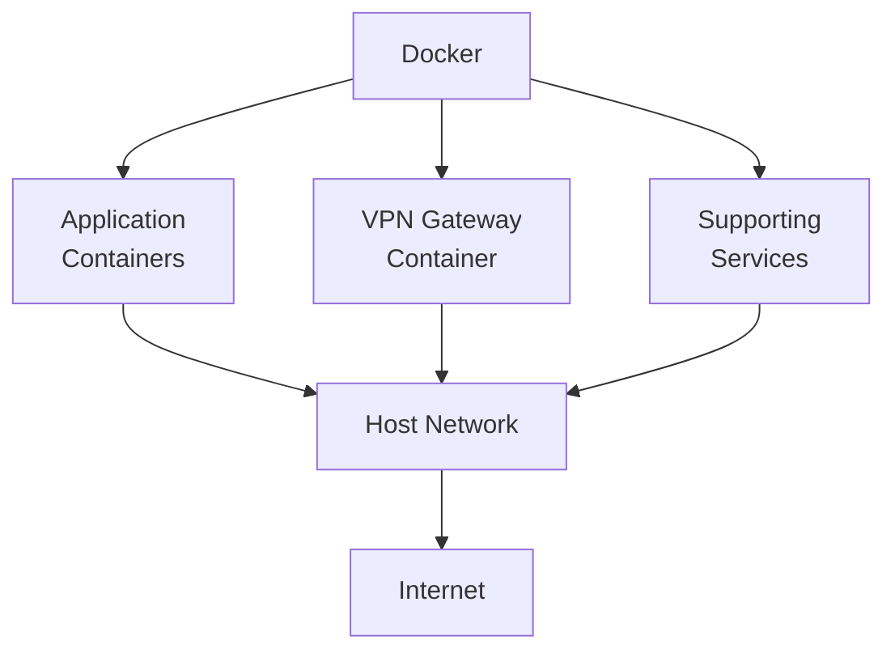
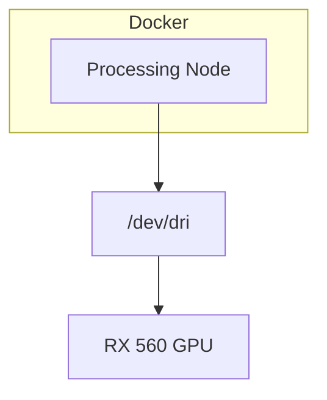
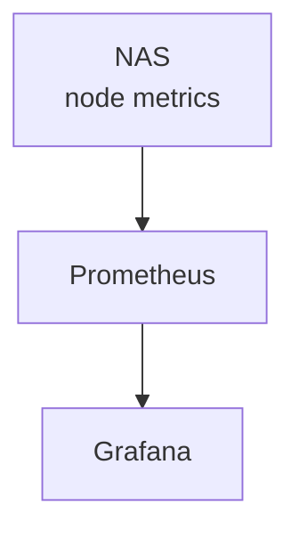

# NAS

This NAS is a headless Ubuntu Server host providing persistent storage, containerised services, and supporting infrastructure for the homelab.

The system is designed around low power consumption, reliability, and keeping persistent data separate from application workloads.

## Hardware

| Component   | Specification       |
| ----------- | ------------------- |
| CPU         | Intel Core i5-4670K |
| RAM         | 28 GB DDR3          |
| Motherboard | Gigabyte GA-B85-HD3 |
| HBA         | LSI SAS3008         |
| GPU         | AMD Radeon RX 560   |
| OS          | Ubuntu Server       |
| Network     | Gigabit Ethernet    |

## Storage

The primary storage pool is provided by ZFS.

The primary pool currently consists of three 6 TB SAS drives in a RAIDZ1 configuration.

Persistent application data is stored separately from container definitions where practical, allowing containers to be recreated without losing application state.

## Container Services

Docker is used to run the majority of application workloads.

Services are grouped according to their networking and storage requirements. Some containers share the network namespace of a VPN gateway container so that their outbound traffic is routed through the VPN.

The VPN-dependent containers are deliberately isolated behind the VPN gateway. A small monitoring script periodically verifies the expected public IP and stops the affected services if the expected network path is not available.

## Media Processing

The host's AMD GPU is passed through to selected containers for hardware-accelerated media processing.

A second system can also act as a remote processing node when additional GPU processing capacity is required.

## Monitoring

Prometheus and Grafana provide host-level monitoring and visualisation.

Node-level metrics are collected from the host, with container and application monitoring being expanded incrementally as required.

## Design Principles

* Prefer simple, understandable infrastructure.
* Keep persistent data on ZFS.
* Use containers for application isolation.
* Minimise unnecessary services running directly on the host.
* Use hardware acceleration where it provides a meaningful benefit.
* Keep security boundaries explicit, particularly around outbound network access.
* Favour incremental improvements over unnecessary complexity.
