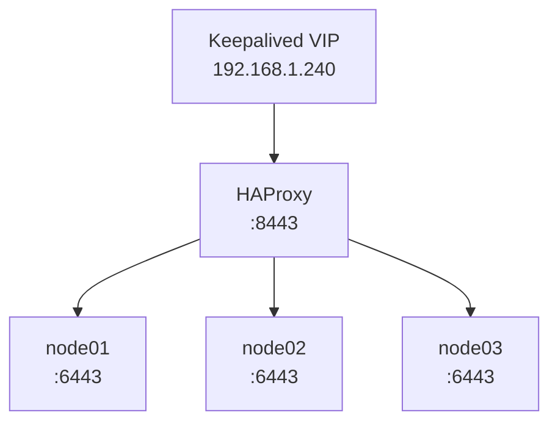
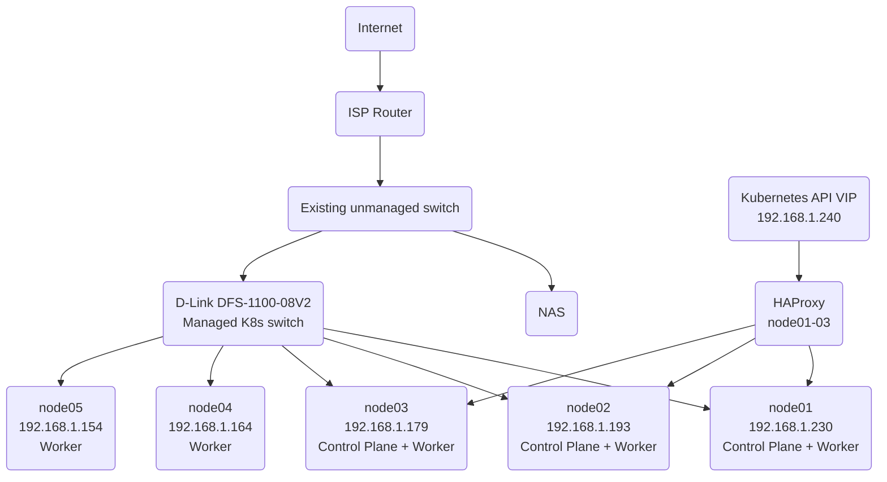

# Kubernetes Cluster Architecture

## Kubernetes Cluster

* 5 × Dell OptiPlex 9020M Micro
* Intel i5-4590T
* Debian 13
* 8GB RAM per node
* 128GB SATA SSD per node
* Gigabit Ethernet
* D-Link DFS-1100-08V2 managed switch

### Node Roles

| Node   | IP Address      | Role                   |
| ------ | --------------- | ---------------------- |
| node01 | `192.168.1.230` | Control plane + worker |
| node02 | `192.168.1.193` | Control plane + worker |
| node03 | `192.168.1.179` | Control plane + worker |
| node04 | `192.168.1.164` | Worker                 |
| node05 | `192.168.1.154` | Worker                 |

## Kubernetes Components

The cluster was bootstrapped using:

* kubeadm
* containerd
* Kubernetes v1.37
* Flannel CNI

The Pod network uses `10.244.0.0/16`.

## High Availability

The Kubernetes API is exposed through a virtual IP:

```text
192.168.1.240:8443
```

Keepalived provides the floating VIP across node01, node02 and node03.

HAProxy runs on all three control-plane nodes and forwards API traffic to the kube-apiserver instances:



Keepalived monitors HAProxy health. If HAProxy fails on the node currently owning the VIP, another eligible control-plane node can assume ownership.

## Physical Topology



## Network Architecture

The physical LAN uses `192.168.1.0/24`.

The Kubernetes API VIP is `192.168.1.240`.

The Kubernetes Pod network uses `10.244.0.0/16` and is implemented by Flannel. The Pod network is logical rather than a physical network configured on the LAN.

See [`networking.md`](networking.md) for a detailed description of the network architecture and traffic flows.

## Network Attached Storage

The Kubernetes cluster is connected to the existing NAS infrastructure on the physical LAN.

The NAS provides:

* Ubuntu Server
* 128GB SSD for the root filesystem
* 3 × 6TB SAS drives using ZFS RAIDZ1
* AMD RX560
* 28GB DDR3 RAM

The NAS hosts the existing media infrastructure separately from the Kubernetes cluster.
