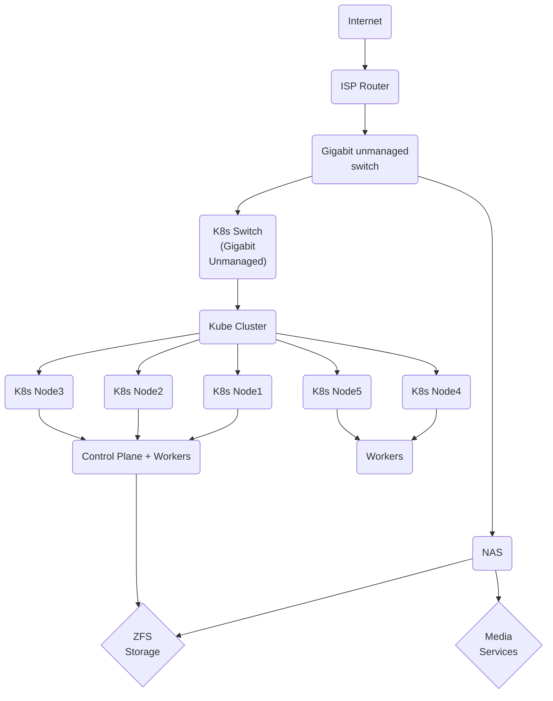

# Kubernetes cluster
- 5 × Dell OptiPlex 9020M
- Debian 13
- 8GB RAM per node (LDDR3)
- 128GB SSD per node
- Gigabit Ethernet
- Unmanaged TP-Link TL-SG108 switch

# Network Attached Storage

- Intel i5 6th Gen
- Ubuntu Server
- 128GB SSD for root file system
- 3 x 6TB SAS Drives (ZFS, RAIDZ1)
- AMD RX560
- 28GB DDR3

Topology:

