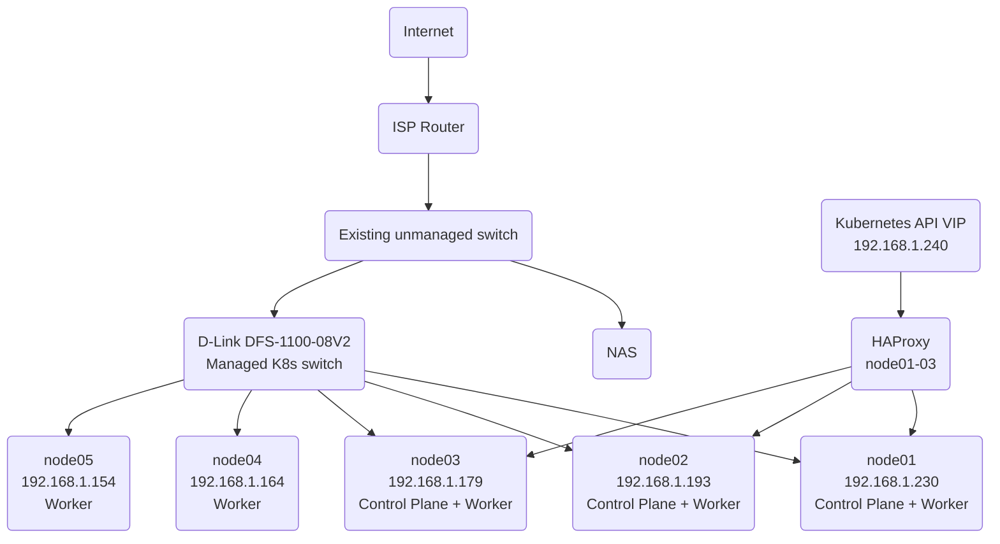

# Kubernetes Networking

## Overview

- Physical LAN provided by ISP router - 192.168.1.0/24
- Kubernetes API VIP provided by KeepAlived - 192.168.1.240
- Kubernetes pod network provided by Flannel - 10.244.0.0/16
- All nodes are connected to the Physical LAN
- Pods are connected to Flannel network

## Physical Network

## Kubernetes API Network

- Floating VIP provided by Keepalived at 192.168.1.240
- HAProxy runs on node01-03
- HAProxy listening on 192.168.1.240:8443
- api-server on node01-03 listening on respective node IP addresses on port 6443

## Control Plane High Availability

- KeepAlived provides floating VIP on 192.168.1.240
    Config for KeepAlived gives preference for the VIP to be owned by node01, with weighting configured to fail over to node02 followed by node03. Provides high availability for the VIP by ensuring that if the current VIP owner fails or HAProxy fails it's health condition, another eligible node can take ownership according to VRRP priority.

  The configured priorities determine which node owns the VIP, with the HAProxy health-check weight reducing a node's priority if HAProxy fails. The weights are configured to ensure that at no time will two healthy nodes have the same priority, this will avoid a split-brain event in the case of a fail over. 

  KeepAlived is also continually polling HAProxy to ensure it's health on that node. A fault with HAProxy on the node that owns the VIP will trigger a failover

- HAProxy provides load balancing to api-servers on control plane nodes
    Configuration of HAProxy was reasonably simple, using least connections as the load balancing algorithm as opposed to round robin. This decision was purely preference.

## Pod Network

- Flannel provides a private network on 10.244.0.0/16
    This network does not need to be directly present on the Physical LAN as the connectivity between the physical LAN and pods on this network address is handled by the CNI (Flannel). Flannel provides the networking required for Pods on different nodes to communicate across the physical network.
  
    The 10.244.0.0/16 network therefore exists as a logical network within the Kubernetes cluster rather than as a physical network on the LAN. The physical network only needs to provide connectivity between the Kubernetes nodes, while Flannel and Kubernetes provide connectivity between the Pods themselves.
  
## Network Addressing

| Network/address  | Purpose                |
| ---------------- | ---------------------- |
| `192.168.1.0/24` | Physical LAN           |
| `192.168.1.230`  | node01                 |
| `192.168.1.193`  | node02                 |
| `192.168.1.179`  | node03                 |
| `192.168.1.164`  | node04                 |
| `192.168.1.154`  | node05                 |
| `192.168.1.240`  | Kubernetes API VIP     |
| `10.244.0.0/16`  | Kubernetes pod network |

## Traffic Flow

- Kubernetes API requests:
    kubectl
      → 192.168.1.240:8443
      → Keepalived-owned node
      → HAProxy
      → one of node01/02/03:6443
      → kube-apiserver

- Pod to Pod on same node:
    Pod → Flannel/Kubernetes networking → Pod

- Pod to Pod on different node:
          Pod on node01
            ↓
         Flannel
            ↓
      physical node network
            ↓
      Flannel on node02
            ↓
      Pod on node02

